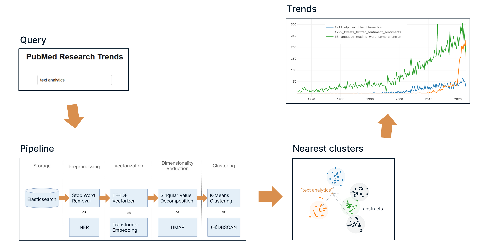

<h1 align="center" style="margin-top: 0px;">Unsupervised Discovery Of Trends In Biomedical Research Based On The PubMed Baseline Repository</h1>
<h2 align="center" style="margin-top: 0px;">Data Science for Text Analytics: Student Project (Public Version)</h2>

<div align="center">

[](https://github.com/psaegert/pmtrendviz/actions/workflows/pytest.yml)
[](https://github.com/psaegert/pmtrendviz/actions/workflows/pre-commit.yml)

</div>



# Table of Contents
1. [Introduction](#introduction)
1. [Requirements](#requirements)
1. [Getting Started](#getting-started)
1. [Usage](#usage)
2. [Development](#development)


# Introduction
[PubMed](https://pubmed.ncbi.nlm.nih.gov/) is an online database of biomedical literature from MEDLINE, life science journals, and online books. It contains over 35 million citations, covering various areas of research related to biomedicine and health since 1965.

Our work aims to offer easy to access insights into hot research areas, establish structure and organize the vast amount of information available in PubMed.
We developed `pmtrendviz`, a python based text-analytics tool that makes use of document embedding and clustering methods to identify research areas without supervision and derive trends on a per-cluster basis for a number of clusters most similar to a given query.

# Requirements
## Software
- Python 3.10
- Docker 20.10.20
- Node 19.4.0 (see the [instructions](docs/install_node.md))
- [Git LFS](https://git-lfs.com/) (optional, for installing pre-trained `pmtrendviz` models)
  - On WSL2, you may need to install `git-lfs` manually, see [this thread](https://stackoverflow.com/questions/68867420/how-to-install-git-lfs-on-wsl2)

## Hardware
### Minimum
- 8GB RAM
- 10GB free disk space

### Recommended
- 32GB RAM
- 70GB free disk space
- GPU (optional)

# Getting Started

## Clone The Repository

```bash
git clone https://github.com/psaegert/pmtrendviz.git
cd pmtrendviz
```

## Create A Virtual Environment (optional):

### With conda

```bash
conda create -n pmtrendviz python=3.10
conda activate pmtrendviz
```

### With venv and pyenv

```bash
pyenv install 3.10
pyenv local 3.10
python -m venv .venv
```

## Install

Option 1 (recommended):<br>
Install the entire package with pip:
```bash
pip install -e .
```

Option 2:<br>
If you do not wish to install the package and run the `main.py` script directly, use the following command to install the dependencies:

```bash
pip install -r requirements.txt
```

## Set up Elasticsearch
```bash
docker compose up -d es01 [elasticvue]
```

Note: The `es01` service is required for all steps of the pipeline.

# Usage
The `pmtrendviz` pipeline consists of four distinct steps: Data collection, training, prediction, and visualization, which can be run in the following ways:
## Crunch the data
Option 1: CLI (recommended)<br>
Check out the [CLI Documentation](docs/cli.md) or the [minimal CLI example](docs/minimal_cli_example.md)

Option 2: Use `pmtrendviz` in your own python code<br>
Check out the [minimal python example](docs/minimal_python_example.md)

## Visualize the results
To start the visualization, run the `start_backend.sh` and `start_frontend.sh` scripts in two separate terminals.
Afterwards, open `http://localhost:5173/` in your browser, and start typing in the search bar (be patient, it may take a while for the models to load into memory).

# Development

## Setup
To set up the development environment, run the following command:
```bash
pip install -r requirements_dev.txt
```

## Tools
We use
- [flake8](https://pypi.org/project/flake8/) to enforce linting
- [mypy](https://pypi.org/project/mypy/) to enforce static typing
- [isort](https://pypi.org/project/isort/) to enforce import sorting
- [pytest](https://pypi.org/project/pytest/) to run tests against our code (see `tests/`)

## Pre-Commit Hooks
To set up linting, static typing, whitespace trailing, ordering of `requirements.txt` and imports when committing, run the following command:
```bash
pre-commit install
```

To run the pre-commit hooks manually, run the following command:
```bash
pre-commit run --all-files
```

Tests can be run with the following command:
```bash
pytest
```

# Citation

If you use this code for your own research, please cite our work:

```bibtex
@misc{pmtrendviz,
  author = {Paul Saegert and Philipp Steichen},
  title = {Unsupervised Discovery Of Trends In Biomedical Research Based On The PubMed Baseline Repository},
  year = {2023},
  publisher = {GitHub},
  journal = {GitHub Repository},
  howpublished = {\url{https://github.com/psaegert/pmtrendviz}},
}
```